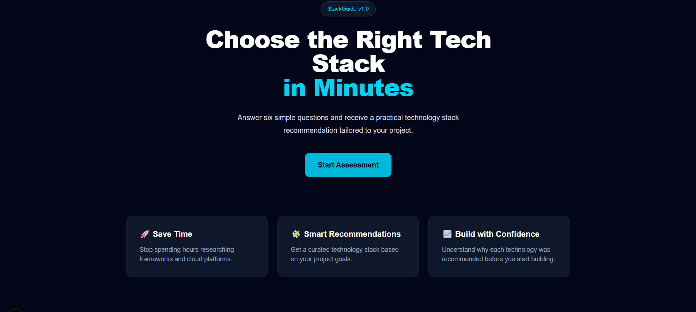
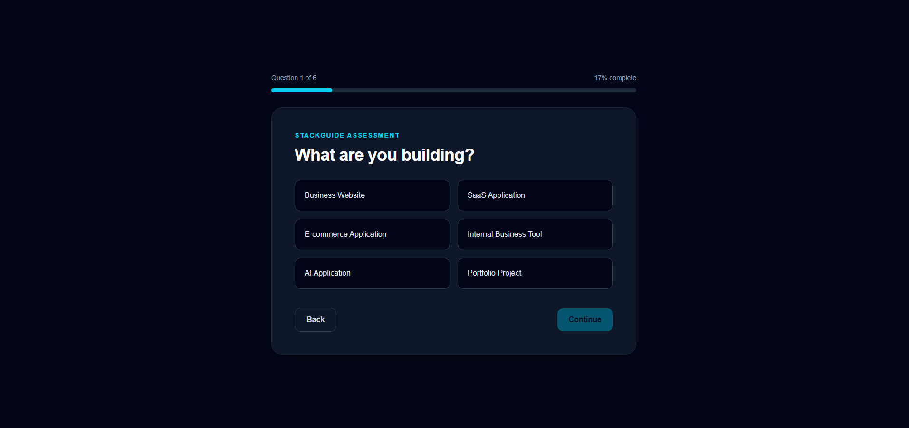
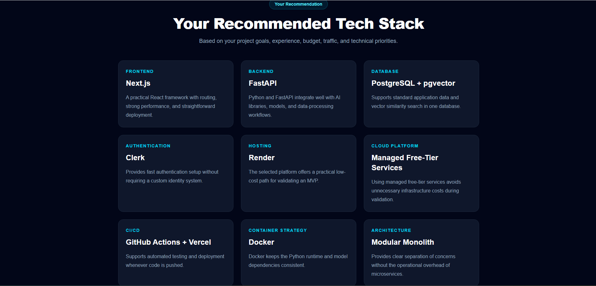

# 🚀 StackGuide

<div align="center">

## Build Smarter. Choose the Right Tech Stack in Minutes

**StackGuide** helps developers, founders, and technical teams choose the right technology stack through a guided six-question assessment. Instead of spending hours researching frameworks, databases, cloud platforms, and deployment strategies, StackGuide provides practical recommendations tailored to each project.

**🌐 Live Demo:** https://stackguide.vercel.app

</div>

---

## Executive Overview

StackGuide is a lightweight decision-support application that helps developers select an appropriate technology stack based on project requirements.

The application demonstrates how a simple rule-based recommendation engine can provide meaningful architectural guidance without relying on artificial intelligence or complex infrastructure.

The primary goal of Version 1.0 was to validate the product idea by delivering a fully functional MVP that users could access through a public web application.

---

# Business Problem

Selecting a technology stack has become increasingly difficult.

Developers must evaluate:

- Frontend frameworks
- Backend technologies
- Databases
- Authentication providers
- Cloud platforms
- Hosting options
- CI/CD pipelines
- Architecture patterns

This often leads to unnecessary research, inconsistent decisions, and analysis paralysis.

---

# Solution

StackGuide simplifies this process by asking six guided questions about a project.

Based on the responses, it recommends:

- Frontend
- Backend
- Database
- Authentication
- Hosting
- Cloud Platform
- CI/CD
- Container Strategy
- Architecture Pattern

Each recommendation includes a short explanation describing why it was selected.

---

# Live Demo

**Production Website**

https://stackguide.vercel.app

---

# Share Feedback

StackGuide v1.0 is currently being evaluated through real user feedback.

After completing the assessment, please share your experience, recommendation results, or improvement ideas through the repository's GitHub Issues page.

[Submit StackGuide Feedback](https://github.com/dlittle-source/stackguide/issues/new/choose)

---

# Screenshots

## Landing Page



---

## Assessment



---

## Recommendation Dashboard



---

# Features

- Modern responsive interface
- Interactive six-question assessment
- Rule-based recommendation engine
- Technology explanations
- Clipboard copy support
- Mobile-friendly design
- Public deployment using Vercel

---

# Technology Stack

| Category | Technology |
|-----------|------------|
| Framework | Next.js |
| Language | TypeScript |
| UI | React |
| Styling | Tailwind CSS |
| Deployment | Vercel |
| Source Control | GitHub |

---

# How It Works

```text
Landing Page
      │
      ▼
Start Assessment
      │
      ▼
Six Guided Questions
      │
      ▼
Recommendation Engine
      │
      ▼
Results Dashboard
      │
      ▼
Copy Results
```

---

# Getting Started

Clone the repository:

```bash
git clone https://github.com/dlittle-source/stackguide.git
```

Install dependencies:

```bash
npm install
```

Run locally:

```bash
npm run dev
```

Open:

```text
http://localhost:3000
```

---

# Lessons Learned

One of the most important engineering decisions for Version 1.0 was intentionally using a rule-based recommendation engine instead of an AI-powered solution.

This approach:

- Reduced development complexity
- Eliminated API costs
- Produced consistent recommendations
- Allowed the MVP to be completed, tested, and deployed in a single development session

The project also reinforced the importance of limiting scope. By focusing only on the core functionality, StackGuide progressed from an idea to a production-ready application without unnecessary features.

---

# Future Roadmap

Future enhancements may include:

- AI-powered recommendations
- Architecture diagram generation
- Cost estimation
- Export to PDF
- Saved assessments
- User accounts
- Team collaboration

---

# Version History

## Version 1.0

- Initial public release
- Professional landing page
- Interactive assessment
- Rule-based recommendation engine
- Recommendation dashboard
- Clipboard copy functionality
- GitHub integration
- Vercel deployment

---

# Author

**Demarko Little**

Cloud Platform Engineer | DevOps Engineer | Enterprise Infrastructure Engineer

GitHub: https://github.com/dlittle-source

LinkedIn: https://linkedin.com/in/demarkol

---

## License

This project is licensed under the MIT License.